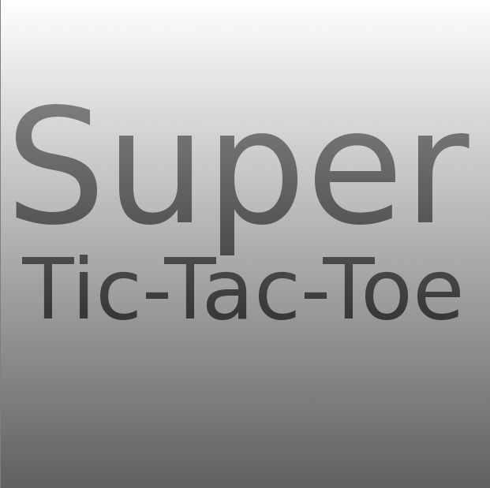
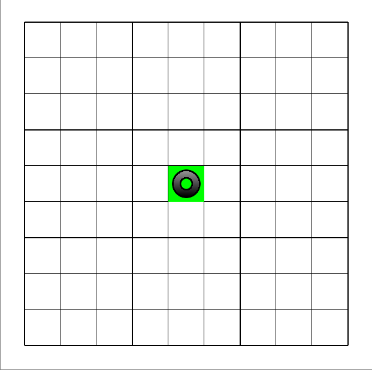
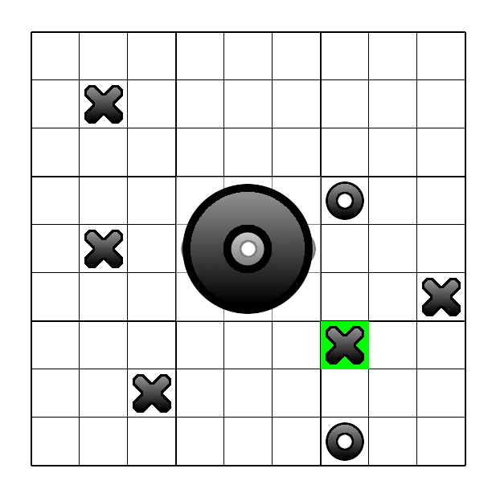
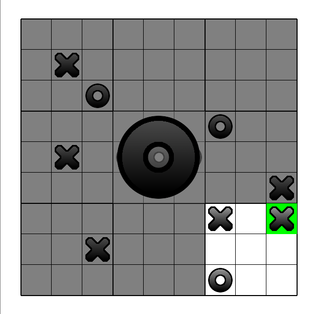
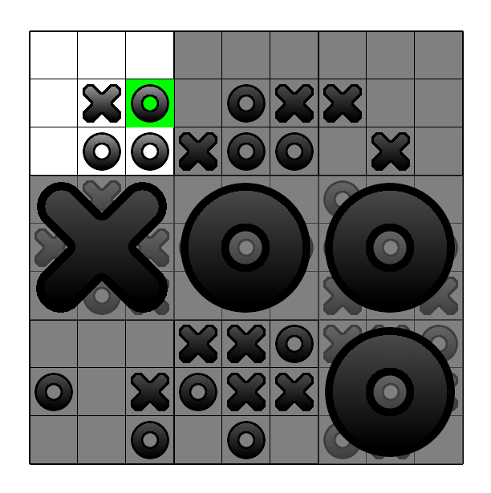

Super Tic Tac Toe
=================

Super Tic Tac Toe is a variant of the classic game of tic tac toe.

This is a implementation using C with OpenGL.

Screenshots
-----------







Game Rules
----------
See [Here]

Dependence
---------
* [GLFW]
* [DevIL]

Build
-----
```sh
cd super-tic-tac-toe
mkdir build
cd build
cmake ..
make
```

  [Here]: http://www.scheinerman.net/jonah/supertictactoe.html
  [GLFW]: http://www.glfw.org/
  [DevIL]: http://sourceforge.net/projects/openil/
